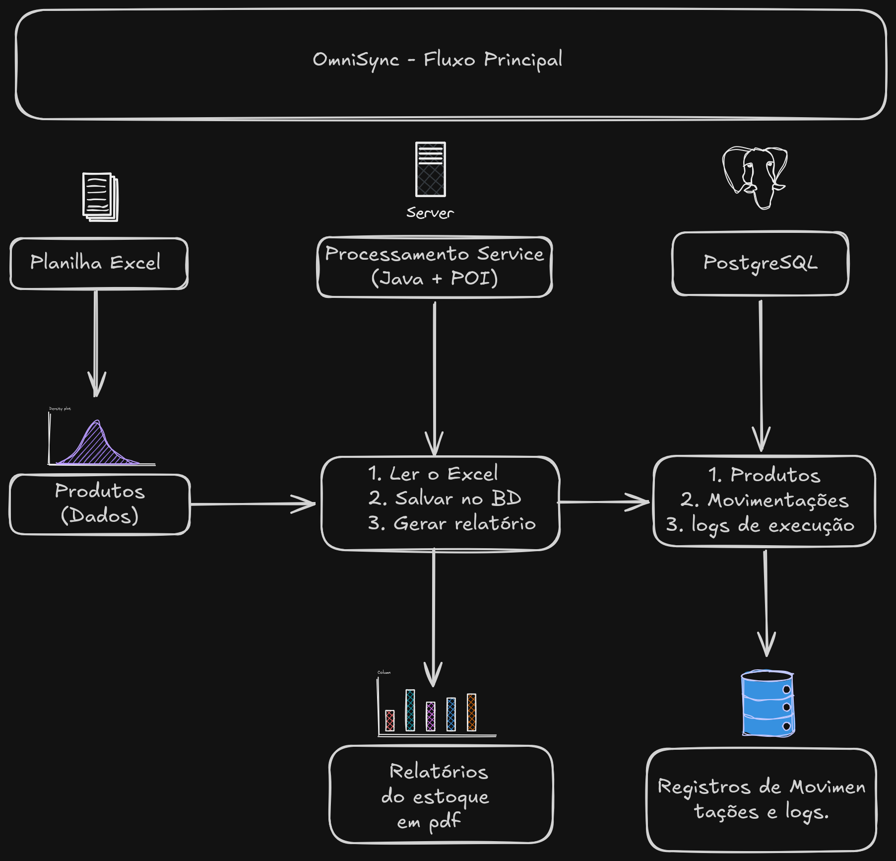

<p align="center">
  
</p>

<h1 align="center">OmniSync</h1>

<p align="center">
  Intelligent Inventory Automation Platform
</p>

<p align="center">
  
  
  
  
</p>

**OmniSync** é um softare de automação voltado para o gerenciamento de estoques. Ele lê planilhas Excel, sincroniza, atualiza e armazena em um banco de dados PostgreSQL os dados vindos do software da Microsoft, gera relatórios PDF e alerta sobre produtos com estoque baixo.

---

## 🚀 **Funcionalidades**

- 📊 **Leitura de Excel** - Lê planilhas `.xlsx` usando Apache POI
- 💾 **CRUD no PostgreSQL** - Persiste dados usando JDBC
- 📄 **Relatórios PDF** - Gera relatórios com OpenPDF
- ⚠️ **Alertas de estoque** - Detecta produtos com estoque baixo automaticamente
- 🧪 **Testes manuais** - Testes para validar movimentações

---

## 📋 **Pré-requisitos**

Antes de executar o projeto, você precisa ter instalado:

### 1. Java 17+
```bash
# Verifique a versão do Java
java -version

```

## 📁 **Estrutura do Projeto**

Abaixo está a organização das pastas e principais arquivos do sistema:

```
OmniSync/
│
├── src/
│   └── com/automacao/estoque/
│       │
│       ├── dao/                           # Camada de Acesso a Dados
│       │   ├── conexaoDAO.java            # Conexão com PostgreSQL
│       │   ├── databaseInitializer.java   # Inicialização do banco
│       │   ├── logExecucaoDAO.java        # CRUD de logs
│       │   ├── movimentacaoDAO.java       # CRUD de movimentações
│       │   └── produtoDAO.java            # CRUD de produtos
│       │
│       ├── model/                         # Entidades (Modelos)
│       │   ├── logExecucao.java           # Modelo de log
│       │   ├── Movimentacao.java          # Modelo de movimentação
│       │   └── Produto.java               # Modelo de produto
│       │
│       ├── service/                       # Regras de Negócio
│       │   ├── excelService.java          # Leitura de Excel (POI)
│       │   ├── PDFService.java            # Geração de PDF (OpenPDF)
│       │   ├── processamentoService.java  # Versão antiga (remover)
│       │   └── ProcessamentoService.java  # ✅ Versão atual (principal)
│       │
│       ├── tests/                         # Testes manuais
│       │   ├── CriarPlanilha.java         # Gera planilha de exemplo
│       │   ├── Main.java                  # ✅ Ponto de entrada principal
│       │   ├── Main2.java                 # Teste antigo (remover)
│       │   ├── TesteMovimentacoes.java    # Teste de movimentações
│       │   └── TesteMovimentacoesDAO.java # Teste do DAO
│       │
│       ├── scheduler/                     # (Reservado para agendamentos)
│       └── util/                          # Utilitários
│
├── lib/                                   # Dependências (JARs)
│   ├── commons-collections4-4.4.jar
│   ├── commons-compress-1.19.jar
│   ├── ooxml-schemas-1.4.jar
│   ├── openpdf-1.3.40.jar
│   ├── poi-4.1.2.jar
│   ├── poi-ooxml-4.1.2.jar
│   ├── postgresql-42.7.13.jar
│   └── xmlbeans-3.1.0.jar
│
├── uploads/                               # Planilhas de entrada
│   └── produtos.xlsx                      # Exemplo de planilha
│
├── reports/                               # PDFs gerados
│   └── relatorio_*.pdf                    # Relatórios de estoque
│
├── assets/                                # Imagens do projeto
│   └── fluxo-omnisync.png                 # Diagrama de fluxo
│
├── .gitignore                             # Arquivos ignorados pelo Git
├── README.md                              # Documentação
└── LICENSE                                # (Opcional) Licença
```

--- 
## 🔧 Configuração do VS Code

### 1. Caso use o VS Code, copie o arquivo de exemplo:

```bash
cp .vscode/settings.json.example .vscode/settings.json
```
### 2. Recarregue o VSCode: 

- **Pressione**: CRTL + Shift + P
- **Digite**: Developer: Reload Window
- **Pressione**: Enter


⚠️ **Extensões recomendadas:** Instale as seguintes extensões para uma melhor experiência.

```bash
- Extension Pack For Java (Microsoft)
- Language Suport For Java (Red Hat)
```
### 3. Estrutura do .vscode:

```
.vscode/
├── settings.json.example   ← Exemplo de configuração (versionado)
└── settings.json           ← Configuração local (NÃO versionado)
```

⚠️ **Importante:** O arquivo settings.json não é versionado no Git. Cada dev deve criar o seu a partir do exemplo que foi fornecido.

### 4. Conteúdo do arquivo de exemplo:

```
{
    "java.project.sourcePaths": [
        "src"
    ],
    "java.project.referencedLibraries": [
        "lib/*.jar"
    ]
}
```
- "src" → O VS Code vai procurar os arquivos .java na pasta src/
- "lib/*.jar" → O VS Code vai adicionar todos os JARs da pasta lib/ ao classpath automaticamente

___

# 🛠️ Tecnologias Utilizadas

Abaixo estão as principais tecnologias, frameworks e bibliotecas utilizadas no projeto:

| Tecnologia | Versão | Finalidade |
|------------|--------|------------|
| **☕ Java** | 17+ | Linguagem de programação principal |
| **🐘 PostgreSQL** | 15+ | Banco de dados relacional |
| **📊 Apache POI** | 4.1.2 | Leitura e escrita de arquivos Excel (.xlsx) |
| **📄 OpenPDF** | 1.3.40 | Geração de relatórios em PDF |
| **🐙 Git** | - | Controle de versão |
| **📦 GitHub** | - | Hospedagem do repositório |
| **🖥️ VS Code** | - | Ambiente de desenvolvimento (opcional) |

---
## 📊 Fluxo do Sistema



*Diagrama do fluxo principal do sistema OmniSync.*

---
### Como testar

- Clonar o repositório:
```bash
git clone https://github.com/BrunoDePaulo-ops/OmniSync.git
cd OmniSync
```

- Criar e configurar o banco:
```bash
sudo -u postgres psql

-- Criar o banco de dados:
CREATE DATABASE autostock;

-- Criar um usuário (opcional, mas recomendado):
CREATE USER omniuser WITH PASSWORD 'omni2024';

-- Dar permissões:
GRANT ALL PRIVILEGES ON DATABASE autostock TO omniuser;

-- Sair
\q
```
- Configurar a conexão com o banco:
```bash
- Edite o arquivo src/com/automacao/estoque/dao/conexaoDAO.java e atualize com os dados do seu banco:

  private static final String URL = "jdbc:postgresql://localhost:5432/autostock";
  private static final String USUARIO = "omniuser";      // seu usuário
  private static final String SENHA = "omni2024";        // sua senha
```

**⚠️ Nota**: O projeto já possui uma planilha base na pasta uploads. Se o usuário quiser criar outra, faça isso dentro desta pasta e altere a linha a seguir no ProcessamentoService.java:

```bash
produtos = excelService.lerProduto("uploads/NomeDaPlanilhaNovaAqui.xlsx"); //Alteração aqui!
```

- Compilar o projeto:
```bash
javac -d bin -cp "lib/*" src/com/automacao/estoque/**/*.java
```
- Executar o sistema:
```bash
java -cp "lib/*:bin" com.automacao.estoque.tests.Main
```
- Após isso, você verá:

```bash
========== OMNISYNC - Sistema de Gerenciamento de Estoques ==========
========== Menu ==========
Digite um número para uma ação...

1. Ler dados direto da planilha.
2. Ler dados direto do banco.
3. Sincronizar planilha, movimentações e banco.
4. Verificar se existem e quais são os produtos com estoque baixo. (Sincronize o sistema antes)
5. Emitir relatório em PDF (Sincronize o sistema antes).
6. Verificar logs gravados no sistema.
7. Verificar as movimentações de um produto específico.
0. Sair.
```


